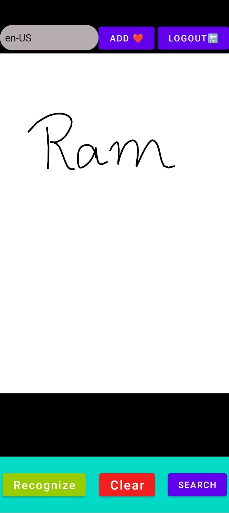
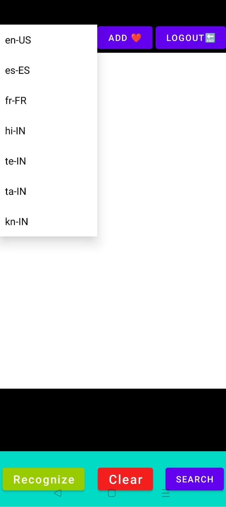

# NoteMute

NoteMute is an Android application that leverages Google ML Kit to convert handwritten notes into text. It includes multiple language recognition, text-to-speech functionality, search features, and a way to save favorite notes.

## Features

- **Handwritten Note Recognition:** Uses Google ML Kit to convert handwritten notes into text.
- **Language Selection:** Allows users to recognize handwriting in multiple languages.
- **Text-to-Speech:** Reads out recognized text, improving accessibility.
- **Search Functionality:** Enables users to search through recognized text.
- **Favorite Notes:** Allows users to save and quickly access important notes.

## Screenshots

Here are some screenshots showcasing NoteMute's features:






## Installation

To run this project locally, follow these steps:

### Prerequisites

- Android Studio
- Android device or emulator

### Steps

1. **Clone the repository:**

   ```bash
   git clone https://github.com/yourusername/notemute.git
   cd notemute
   ```

2. **Open the project in Android Studio:**
   - Open Android Studio.
   - Select "Open an existing Android Studio project".
   - Navigate to the cloned repository folder and select it.

3. **Build the project:**
   - Click on "Build" in the top menu and select "Make Project" or press `Ctrl+F9`.

4. **Run the project:**
   - Click on "Run" in the top menu or press `Shift+F10`.

## Usage

1. **Handwritten Note Recognition:**
   - Open the app and take a picture of your handwritten note.
   - The app will recognize and convert the handwriting into text.

2. **Language Selection:**
   - Go to the settings and select your preferred language for handwriting recognition.

3. **Text-to-Speech:**
   - After recognizing text, tap the speaker icon to have the text read aloud.

4. **Search Functionality:**
   - Use the search bar to find specific text within your recognized notes.

5. **Favorite Notes:**
   - Tap the star icon to save a note as a favorite for quick access.

## Technical Details

### Handwritten Note Recognition

The core functionality of NoteMute involves converting handwritten notes into text using Google ML Kit. This allows for accurate and efficient recognition across multiple languages.

### Language Selection

Users can select their preferred language from the app settings. This flexibility ensures that notes in different languages can be accurately recognized.

### Text-to-Speech

Text-to-speech functionality is integrated to enhance accessibility, allowing users to listen to their notes.

### Search Functionality

Recognized text is indexed to allow users to search for specific notes, making it easy to find important information.

### Favorite Notes

Users can save important notes as favorites, which are then easily accessible from a dedicated section within the app.

## Contributing

We welcome contributions to enhance NoteMute. To contribute:

1. Fork the repository.
2. Create a new branch (`git checkout -b feature-branch`).
3. Commit your changes (`git commit -am 'Add new feature'`).
4. Push to the branch (`git push origin feature-branch`).
5. Create a new Pull Request.

## Contact

For questions or feedback, please reach out to us at [ramakanthrg2003@gmail.com](mailto:ramakanthrg2003@gmail.com).

---
